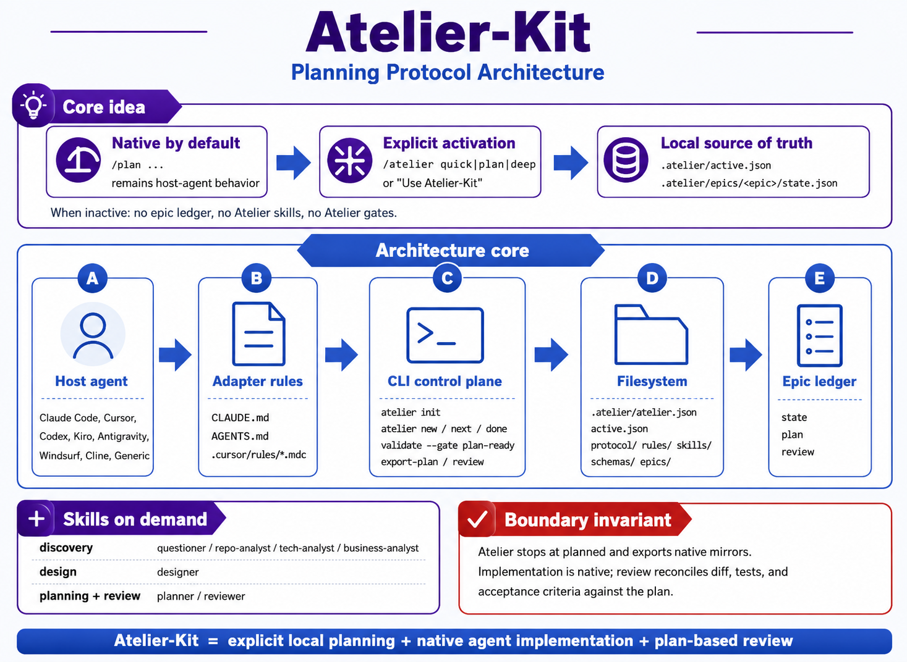

# atelier-kit architecture

Atelier-Kit is a **planning protocol**: a convention for where artifacts
live under `.atelier/` and how an epic moves from questions to a finished plan.
It does **not** sit between you and the agent as an extra planner or executor.

Until someone turns Atelier on (`/atelier ...` or an equivalent explicit cue),
the coding agent works like always—same commands, same habits. After activation,
the agent still does the thinking: reading the repo, drafting research and
`plan.md`, and later implementing. Atelier mostly structures outputs and tracks
state; it does not substitute for those steps.



## Layers

1. **Protocol files** in `.atelier/protocol/`
2. **Rules and adapters** in `.atelier/rules/`
3. **On-demand skills** in `.atelier/skills/`
4. **Schemas** in `.atelier/schemas/`
5. **Per-epic ledgers** in `.atelier/epics/<epic>/`
6. **CLI helpers** that initialize, validate, render rules, export native plans
   and move protocol state

The interesting rules live in those protocol files, schemas, rules and skills.
The CLI stays small on purpose: it moves state and checks invariants. You will
not find a hidden orchestrator, session store or implementation runner inside
it.

## Source of truth

Global activation:

```text
.atelier/active.json
```

Active epic state:

```text
.atelier/epics/<epic-slug>/state.json
```

The active epic `state.json` stores:

- mode: `quick`, `standard` or `deep`
- status: `discovery`, `synthesis`, `design`, `planning`, `planned`, `review`,
  `done` or `blocked`
- active skill
- required artifacts
- slices
- guard metadata
- violations

No other file is operational state. Atelier does not use `.atelier/context.md`
or `.atelier/plan/` as a second source of truth.

## Activation model

Atelier is inactive by default.

```text
/plan add this endpoint
```

Same as always: native planning only—no epic, no Atelier artifacts.

Atelier activates only through explicit requests:

```text
/atelier quick add this endpoint
/atelier plan add payments
/atelier deep migrate authentication to SSO
Use Atelier-Kit for this feature
```

## CLI surface

The primary commands are:

```bash
atelier init
atelier new "Add payment endpoint" --mode quick
atelier status
atelier validate
atelier doctor
atelier render-rules --adapter cursor
atelier export-plan --adapter claude-code
atelier review
atelier next
atelier done
atelier off
```

## State transitions

Typical flow (standard/deep; **quick** skips synthesis and design tasks):

```text
native
  -> discovery/questioner
  -> discovery/research
  -> synthesis
  -> design
  -> planning
  -> planned
  -> native agent implementation
  -> review
  -> done
```

`planned` is where Atelier steps aside: there is a validated `plan.md`, usually a
native mirror export, and from here the host agent ships the work however it
already prefers—tools, plan UI, tests, all unchanged.

## Validation

`atelier validate` checks:

- `atelier.json` and `active.json`
- when active: epic `state.json`, task/skill coherence, required artifacts on disk,
  done-task artifacts that are not empty placeholders
- `plan.md` reviewable shape when status is `planned`, `review` or `done`

`atelier doctor` runs the same validation, then verifies `.atelier/protocol/*`,
rules, skills, schemas and (from `atelier.json`) the adapter rule files expected
for your host—still **not** the contents of an exported plan mirror path.

`atelier validate --gate plan-ready` is enforced before `atelier done` can
finalize planning. It requires:

- active epic exists
- `plan.md` exists
- plan has slices
- slices have goals, acceptance criteria and validation
- risks are documented

## Skills

Each skill is a narrow playbook for one stretch of the epic (questions first,
then repo research, and so on). Load **only** the file named by `active_skill`;
everything else can stay closed until that phase matters.

Examples:

- `questioner` writes `questions.md`
- `repo-analyst` writes `research/repo.md`
- `planner` writes `synthesis.md`, `plan.md` and state updates
- `reviewer` writes `review.md` after native implementation

## Adapter rendering

`atelier render-rules --adapter <name>` writes concrete rule files for the
selected host:

| Adapter | Output |
|---|---|
| Cursor | `.cursor/rules/atelier-core.mdc` |
| Claude Code | `CLAUDE.md` |
| Codex | `AGENTS.md` |
| Cline | `.clinerules/atelier-core.md` |
| Windsurf | `.windsurfrules` |
| Generic | `AGENTS.md` |

Use `--stdout` to print instead of writing files.
