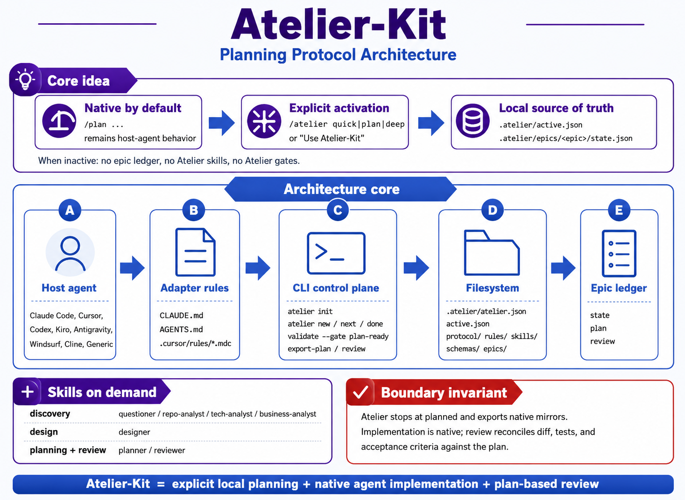

# atelier-kit architecture

Atelier-Kit is a **planning protocol**: a convention for where artifacts
live under `.atelier/` and how an epic moves from questions to a finished plan.
It does **not** sit between you and the agent as an extra planner or executor.

Until someone turns Atelier on (`/atelier ...`, an equivalent explicit cue, or a
native plan hook), the coding agent works like always—same commands, same
habits. After activation, the agent still does the thinking: reading the repo,
drafting research and `plan.md`, and later implementing. Atelier mostly
structures outputs and tracks state; it does not substitute for those steps.

**The runtime is file-based.** The agent bootstraps epics, runs gate self-checks,
and writes the review by reading and writing files under `.atelier/` — the
`atelier` CLI is optional (installation + deterministic re-verification) and never
required to plan.



## Layers

1. **Protocol files** in `.atelier/protocol/`
2. **Rules and adapters** in `.atelier/rules/`
3. **On-demand skills** in `.atelier/skills/`
4. **Schemas** in `.atelier/schemas/`
5. **Per-epic ledgers** in `.atelier/epics/<epic>/`
6. **CLI helpers** that initialize, validate, render rules, export native plans
   and optionally move protocol state

The interesting rules live in those protocol files, schemas, rules and skills.
The CLI stays small on purpose: it scaffolds state and checks invariants. The
agent-led skill flow may update the active epic ledger directly; you will not
find a hidden orchestrator, session store or implementation runner inside the
CLI.

## Source of truth

Global activation:

```text
.atelier/active.json
```

Active epic state:

```text
.atelier/epics/<epic-slug>/state.json
```

The active epic `state.json` stores:

- mode: `quick`, `standard` or `deep`
- status: `discovery`, `design`, `planning`, `planned`, `review`,
  `done` or `blocked` (`synthesis` remains valid for legacy ledgers)
- active skill
- required artifacts
- slices
- guard metadata
- violations

No other file is operational state. Atelier does not use `.atelier/context.md`
or `.atelier/plan/` as a second source of truth.

## Activation model

Atelier is inactive by default.

```text
/plan add this endpoint
```

Without native-plan hooks, same as always: native planning only. With hooks, the
host plan mode can create a V2 epic and inject the active framework step while
the plan remains host-native.

Atelier activates only through explicit requests:

```text
/atelier quick add this endpoint
/atelier plan add payments
/atelier deep migrate authentication to SSO
Use Atelier-Kit for this feature
```

## CLI surface (optional)

The CLI installs the files and offers deterministic re-checks; the runtime never
depends on it. Installation commands:

```bash
atelier init
atelier render-rules --adapter cursor
atelier install-adapter claude-code
```

Optional runtime helpers, each with a file-based equivalent the agent performs
directly (bootstrap via `.atelier/skills/bootstrap.md`, gate self-checks, review
via `.atelier/skills/reviewer.md`, state edits):

```bash
atelier new "Add payment endpoint" --mode quick   # ≙ bootstrap.md
atelier validate [--gate research-ready|plan-ready]
atelier status | atelier doctor
atelier export-plan --adapter claude-code          # ≙ copy plan.md
atelier host-plan start | finalize
atelier review | next | done | off
```

## State transitions

Typical flow (standard/deep; **quick** starts directly at planning, with
research inline in `plan.md`):

```text
native
  -> discovery/questioner   (## Questions section of research.md)
  -> discovery/researcher   (remaining sections of research.md)
  -> design                 (deep; optional in standard)
  -> planning
  -> planned
  -> native agent implementation (progress recorded back into plan.md)
  -> review
  -> done
```

`planned` is where Atelier steps aside: there is a validated `plan.md`, optionally
a native mirror the agent copied, and from here the host agent ships the work
however it already prefers—tools, plan UI, tests, all unchanged.

## Validation

Gates are self-checks the skills run against their artifacts (no CLI). The same
rules are also available as an optional deterministic re-check via
`atelier validate`, which verifies:

- `atelier.json` and `active.json`
- when active: epic `state.json`, task/skill coherence, required artifacts on disk,
  done-task artifacts that are not empty placeholders
- `plan.md` reviewable shape when status is `planned`, `review` or `done`

`atelier doctor` runs the same validation, then verifies `.atelier/protocol/*`,
rules, skills, schemas and (from `atelier.json`) the adapter rule files expected
for your host—still **not** the contents of an exported plan mirror path.

The **research-ready** self-check gates the research task (standard/deep): the
consolidated `research.md` must have the sections the mode demands, no `_Pending._`
leftovers, non-generic questions, and stay within the ~300-line budget.

The **plan-ready** self-check gates finalizing planning. It requires:

- active epic exists
- `plan.md` exists
- plan has slices
- slices have goals, allowed files, acceptance criteria and validation
- risks are documented

Both are also runnable as `atelier validate --gate <name>` for an optional
deterministic double-check.

## Skills

Each skill is a narrow playbook for one stretch of the epic (bootstrap, then
questions, then consolidated research, and so on). Load **only** the file named by
`active_skill`; everything else can stay closed until that phase matters.

The skills:

- `bootstrap` creates the epic ledger + stub artifacts from files at activation
- `questioner` writes the `## Questions` section of `research.md`
- `researcher` fills the remaining sections of `research.md` (one consolidated,
  compact document)
- `designer` writes `design.md` (decisions embedded as ADRs; risk register,
  rollback and test strategy as sections in deep mode)
- `planner` writes `plan.md` and state updates
- `reviewer` writes `review.md` after native implementation, checking the diff
  against each slice's `allowed_files`

## Adapter rendering

`atelier render-rules --adapter <name>` writes concrete rule files for the
selected host:

| Adapter | Output |
|---|---|
| Cursor | `.cursor/rules/atelier-core.mdc` |
| Claude Code | `CLAUDE.md` |
| Codex | `AGENTS.md` |
| Cline | `.clinerules/atelier-core.md` |
| Windsurf | `.windsurfrules` |
| Generic | `AGENTS.md` |

Use `--stdout` to print instead of writing files.
