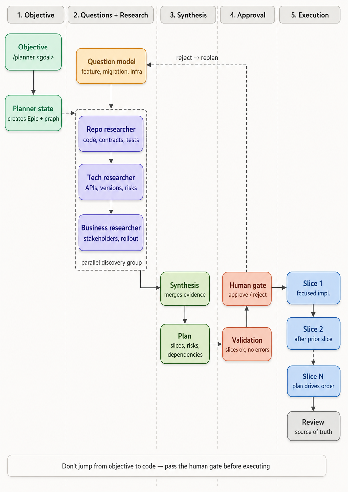
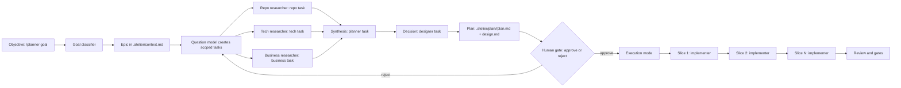
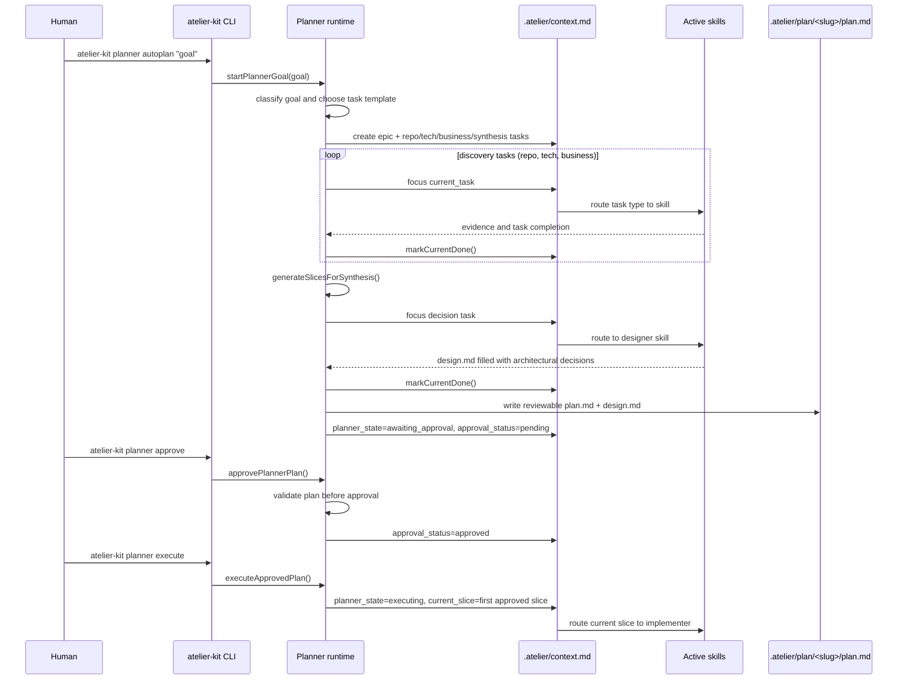
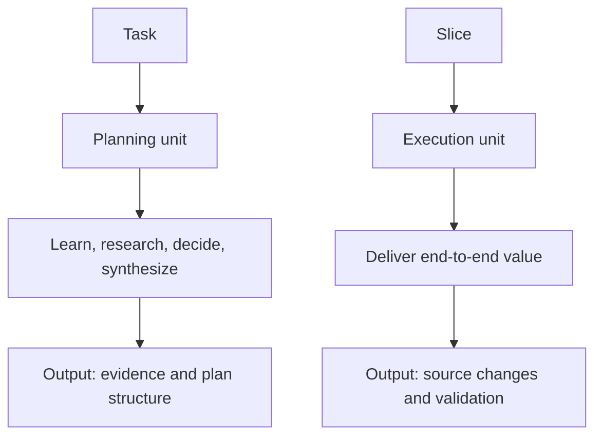
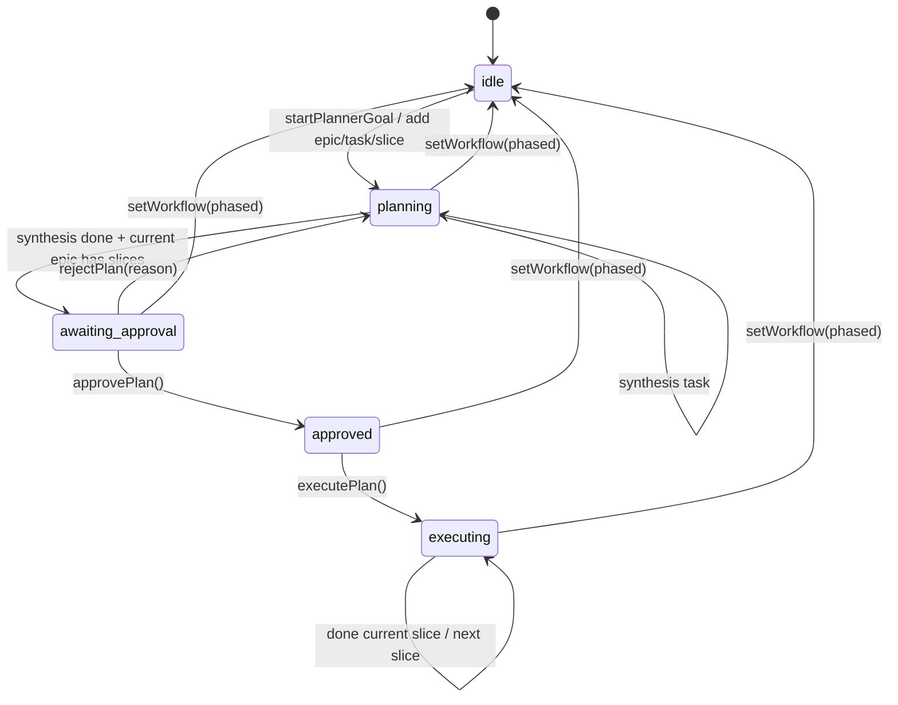
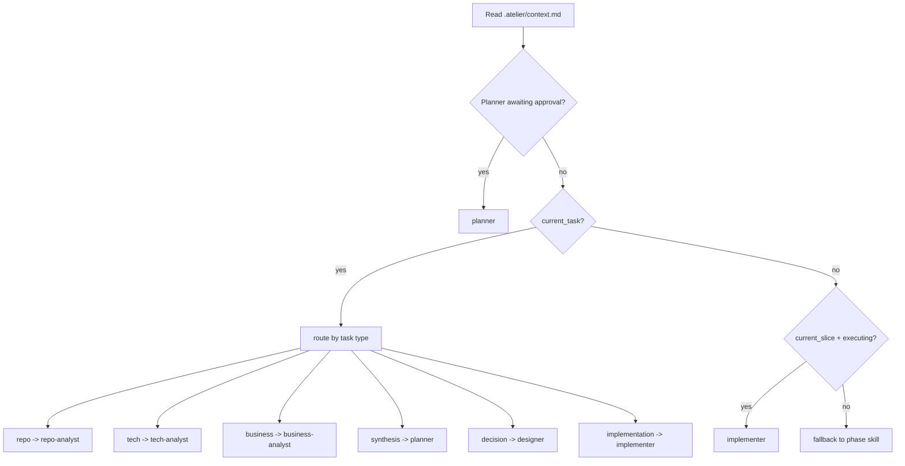
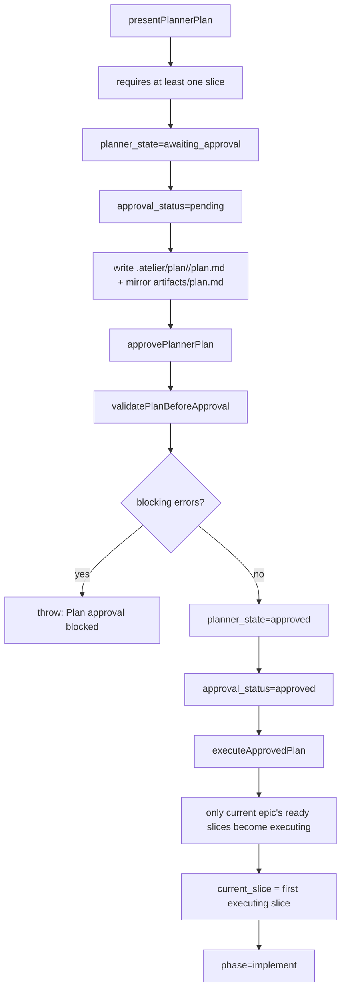
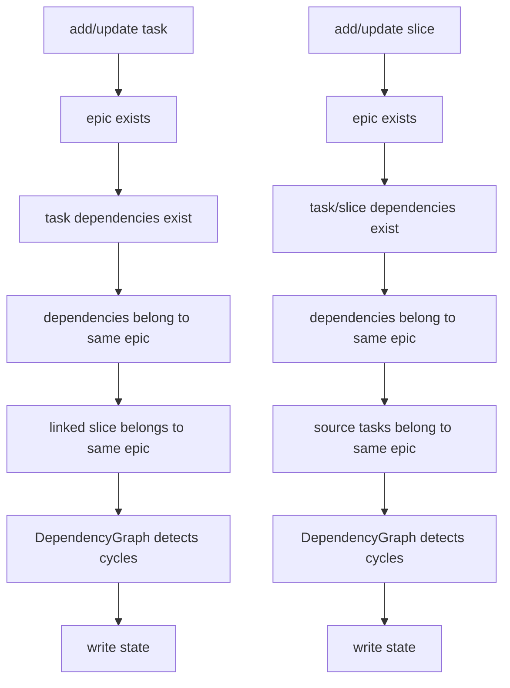
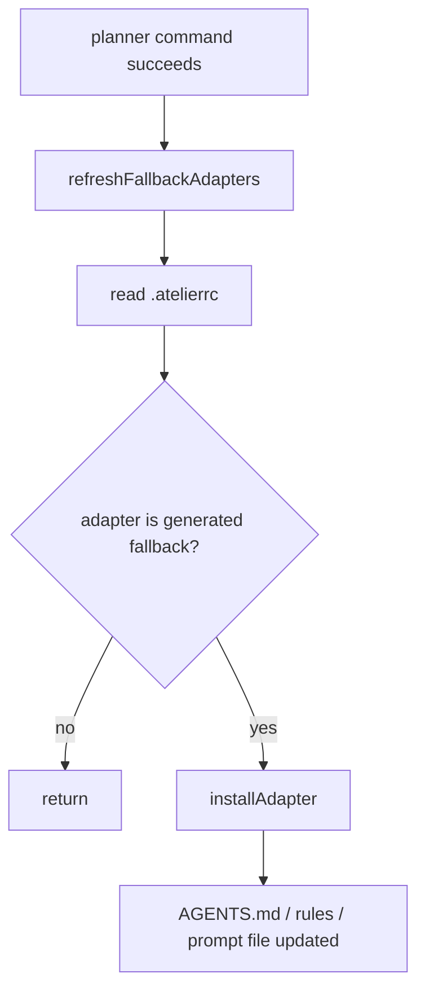

# atelier-kit execution flow

This document describes the execution idea implemented by atelier-kit.

The important point is that atelier-kit does **not** jump from a goal directly to
code. It first turns the goal into planning questions, routes those questions to
specialized researcher tasks, synthesizes the evidence into a plan, stops for
human approval, and only then executes approved vertical slices.

High-level PNG:

## Mental Model

## Implemented Happy Path

## What Gets Created From An Objective

`startPlannerGoal` receives a raw goal and creates one epic plus a set of tasks.
The task template is selected by `classifyGoal` in `src/state/task-templates.ts`.

Supported goal classes:

- `migration`
- `new-feature`
- `refactor`
- `infrastructure`
- `research`
- `default`

Each template creates the same planning shape:

| Task type | Active skill | Purpose |
|-----------|--------------|---------|
| `repo` | `repo-analyst` | Map repository facts: entrypoints, contracts, dependencies, tests, persistence, and operational boundaries. |
| `tech` | `tech-analyst` | Gather external evidence: platform constraints, APIs, versions, tradeoffs, compatibility, security, or migration risks. |
| `business` | `business-analyst` | Clarify rollout, stakeholder impact, acceptance criteria, operational risk, and decision constraints. |
| `synthesis` | `planner` | Converge the discovery tracks into executable slices, dependencies, risks, and acceptance checks. |

The `repo`, `tech`, and `business` tasks receive a shared `parallel_group`.
That models them as parallel discovery tracks, even though the built-in
`autoplan` command advances them sequentially.

## Task And Slice Boundary

The framework makes a hard distinction between planning work and delivery work.

Use this rule:

- **Tasks** answer: what do we need to learn, decide, or de-risk?
- **Slices** answer: what can we safely deliver end-to-end next?

## Runtime State Machine

The planner state is stored in `.atelier/context.md`.

Important fields:

- `workflow`
- `planner_mode`
- `planner_state`
- `approval_status`
- `current_epic`
- `current_task`
- `current_slice`
- `epics[]`
- `tasks[]`
- `slices[]`

The `phase` field still exists, but it is an internal routing lens used by skills
and adapters. The planner state is the machine state.

## Skill Routing

Skill routing is implemented in `src/skill-loader.ts`.

## Approval Gate

Execution is blocked until the plan is approved.

Current approval validation checks:

- synthesis task is done
- at least one slice exists
- each slice has a goal
- warnings are emitted for incomplete discovery or missing acceptance criteria

## Dependency And Safety Checks

The planner validates entity links before writing state.

Focus selection also stays within `current_epic`. Blocked tasks are not selected as
the next focus.

## What `plan.md` Represents

`plan.md` is a review projection, not the only source of truth. The canonical copy for each planning run lives under `.atelier/plan/<slug-do-epico>/plan.md` (with `context.md` and `manifest.json` alongside it). The same content is mirrored to `.atelier/artifacts/plan.md` for compatibility.

It is generated from planner state and includes:

- metadata header
- active epic
- parallel discovery tracks
- proposed slices
- dependency map
- risk register
- open questions
- human review status

The graph in `.atelier/context.md` is operational truth. The markdown plan is the
human approval surface.

## Adapter Refresh

After planner commands mutate state, generated adapters are refreshed when the
active adapter depends on fallback instruction files.

This keeps host agents aligned with the current planner state and command protocol.

## One Sentence Summary

atelier-kit turns a raw objective into structured discovery tasks, synthesizes those
tasks into a reviewable slice plan, requires human approval, and then coordinates
execution one approved slice at a time.
