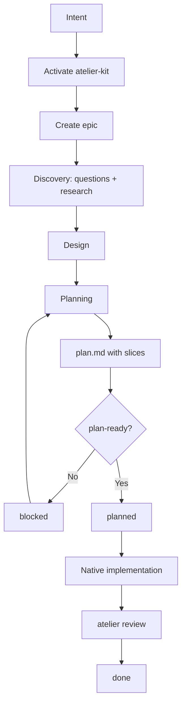

# atelier-kit Manifesto

## The problem

Agent-assisted development is fast and getting faster. But speed without
structure creates its own debt: implicit plans, decisions scattered through
chat, lost context, elastic scope, and implementations that are hard to audit.

Planning still happens. It just leaves no trail you can review, version, or
compare against what actually shipped.

## What atelier-kit is

An **installable planning protocol** that lives inside the repository, runs
only when you ask for it, and turns intent into verifiable artifacts before
implementation starts.

It does not replace the coding agent. It does not introduce a new executor.
It defines where planning lives, how state moves, what evidence must exist,
and when a plan is ready to hand off.

---

## Four pillars

### 1. Planning ≠ implementation

atelier-kit covers planning only.

During planning the protocol structures questions, research, design, and the
plan. Once `plan.md` passes the `plan-ready` gate, atelier-kit steps aside.
Implementation happens with Claude Code, Cursor, Codex, Kiro, or whichever
agent you already use — no hand-off, no second runtime, no proxy.

The protocol does not freeze the agent in place. It draws a boundary around
the planning surface so everything outside it stays native.

### 2. The plan is a verifiable contract

`plan.md` is not a loose task list. It is a contract between intent, design,
and implementation.

Each slice declares:

- a goal that can be implemented and tested,
- the files it may modify (`allowed_files`),
- observable acceptance criteria,
- validation commands that an outside tool can run.

That contract is the **agent's own commitment**. The framework checks two
things and only two things: (1) before `planned`, that the contract is
auditable — `plan-ready` rejects slices with catch-all `allowed_files` or
unobservable criteria; (2) after implementation, that the diff and the
validation evidence match what was promised. `atelier review` is a linter
on the contract the agent signed, not a judge of the work.

### 3. State lives in the repo

Conversations disappear. Prompts change. Sessions expire. Context fragments.

atelier-kit stores operational state in files that are versioned alongside
the code:

```text
.atelier/active.json                    # is the protocol on, and for which epic?
.atelier/epics/<epic-slug>/state.json   # one ledger per epic — phase, skill, slices, violations
.atelier/epics/<epic-slug>/             # questions.md, research/, design.md, plan.md, review.md
```

These are the only authoritative files. Planning stops being a sequence of
chat messages and becomes a set of reviewable, diffable, auditable artifacts
the team owns.

### 4. Opt-in

atelier-kit is **inactive by default**. Nothing changes until you say so.

Activation is explicit — `/atelier quick|plan|deep <goal>` in chat, or
`atelier new "<goal>"` in the CLI. There is no hook that quietly intercepts
your native planning. For simple work, the agent's native flow stays
untouched. For work with risk, multiple modules, or a need for traceability,
you turn the protocol on.

When it is off, the agent ignores `.atelier/` entirely.

---

## The full cycle



Modes calibrate depth, not direction: `quick` skips synthesis and design;
`standard` runs the full discovery → design → planning arc; `deep` adds a
required business research track, risk register, rollback, and a critique
pass. Same protocol, weighted to risk.

---

## What atelier-kit is not

- **Not an executor or agent orchestrator.** The coding agent still reasons,
  reads the repo, proposes, and implements. The protocol persists artifacts
  and validates the contract; it does not write code or run your stack.
- **Not a replacement** for Claude Code, Cursor, Codex, Kiro, Kilo Code,
  Windsurf, Cline, Antigravity, or any IDE.
- **Not a mandatory process.** For changes where native flow is enough,
  leave atelier-kit off.

---

## Why it is worth installing

We do not need agents that only write more code faster. We need agents whose
work is **legible, verifiable, and accountable** — and that we can trust at
the speed agents now move.

The bet is small: a tiny CLI, a few hundred lines of protocol, and a
`.atelier/` directory you can delete with one command. The leverage is in
treating the plan as a contract and the review as a linter on that contract.

---

## Where to go next

- [PROTOCOL.md](./PROTOCOL.md) — state machine, gates, source-of-truth files.
- [ARCHITECTURE.md](./ARCHITECTURE.md) — internal architecture, layers, validation.
- [README.md](./README.md) — install, CLI surface, adapter matrix.
- [CONTRIBUTING.md](./CONTRIBUTING.md) — clean-room rule, dev setup.

Not affiliated with HumanLayer. See [CREDITS.md](./CREDITS.md).
