# The atelier-kit Manifesto

## A protocol for bringing intent, context, and verification back to agent-assisted development

Agent-assisted development has changed how quickly software can be planned, written, and reviewed. But speed without structure creates its own kind of debt: implicit plans, decisions scattered through chat, lost context, elastic scope, and implementations that are hard to audit.

**atelier-kit** exists to solve that problem.

It does not try to replace the coding agent. It does not introduce a new executor. It does not force a new IDE, a new workflow, or a new way of programming.

atelier-kit proposes something simpler, and more useful:

> **an installable planning protocol that lives inside the repository, runs only when requested, and turns intent into verifiable artifacts before implementation begins.**

It defines where planning lives, how state moves forward, what evidence must exist, and when a plan is ready to hand off to the implementation agent.

---

## 1. We believe agents need rails, not cages

A coding agent should still reason, read the repository, propose solutions, and help with implementation.

But that work needs a minimum contract:

- the intent must be explicit;
- the research must leave a trail;
- the design must be reviewable;
- the plan must be sliced;
- the files that may be changed must be clear;
- validation must be verifiable;
- review must compare what was delivered with what was promised.

atelier-kit does not freeze the agent in place. It creates a shared surface where humans and agents can collaborate with less ambiguity.

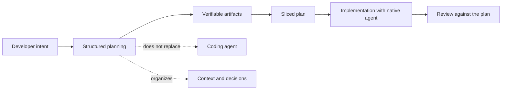

---

## 2. atelier-kit is opt-in by design

Nothing changes until the developer asks for it.

While the protocol is inactive, the agent completely ignores the `.atelier/` directory. It keeps working the same way it always has.

When the developer activates the protocol, atelier-kit creates an epic, records the operational state, and guides the agent through the right phases.

That choice matters.

A planning protocol is useful only when it reduces uncertainty. For simple tasks, the agent's native flow may be enough. For changes with risk, multiple modules, architectural impact, or a need for traceability, atelier-kit steps in.

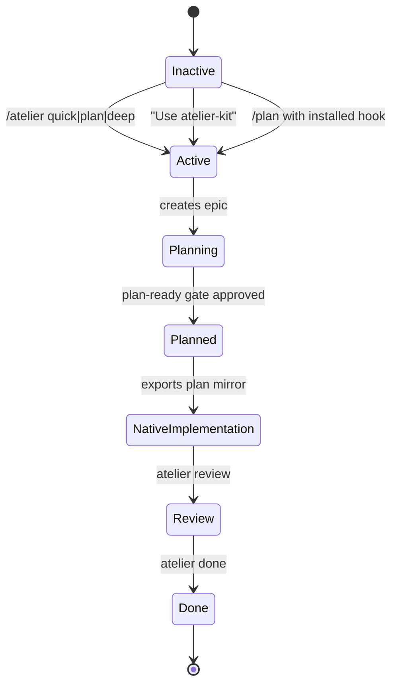

---

## 3. Planning and implementation are different jobs

atelier-kit deliberately separates two phases that are often blurred together:

1. **planning what should be done**;
2. **implementing it with the chosen coding tool**.

During planning, the protocol structures questions, research, synthesis, design, and the plan.

Once the plan is approved, atelier-kit gets out of the way. Implementation can happen with Claude Code, Cursor, Codex, Kiro, Kilo Code, Windsurf, Cline, Antigravity, or any compatible agent.

The canonical file stays in the repository, while the plan can also be mirrored to the agent's native location.

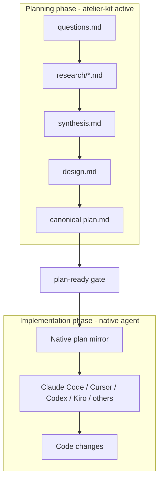

---

## 4. The repository is the source of truth for planning

Conversations disappear. Prompts change. Sessions expire. Context fragments.

That is why atelier-kit stores state and artifacts inside the repository itself.

Each epic has a ledger under `.atelier/epics/<epic-slug>/`. That ledger holds the current state, questions, research, synthesis, design, plan, and review.

Planning stops being a loose sequence of chat messages and becomes a set of versionable, reviewable, auditable artifacts.

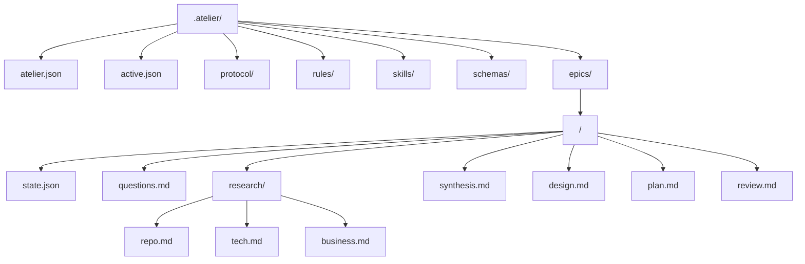

---

## 5. Every epic needs explicit state

An epic should not depend on chat memory.

The `state.json` file is the operational source of truth. It tells the agent which epic is active, which phase is running, which skill to load, which artifacts are required, and which violations block progress.

The state flow is clear:

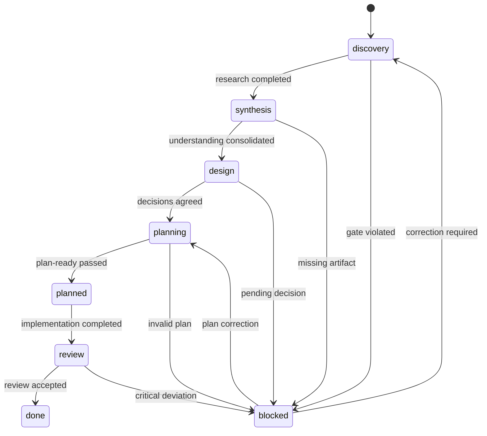

Explicit state prevents the agent from moving ahead on assumptions. Every transition must leave evidence behind.

---

## 6. The agent should load only the instruction for the current phase

One common problem with coding agents is too many instructions competing for attention.

When everything is in context at once, the agent blends roles: it asks questions while it should be researching, proposes solutions while it should be synthesizing, and implements while it should still be planning.

atelier-kit applies a simple principle:

> **each phase has one skill, and the agent reads only the active skill.**

The read order is controlled:

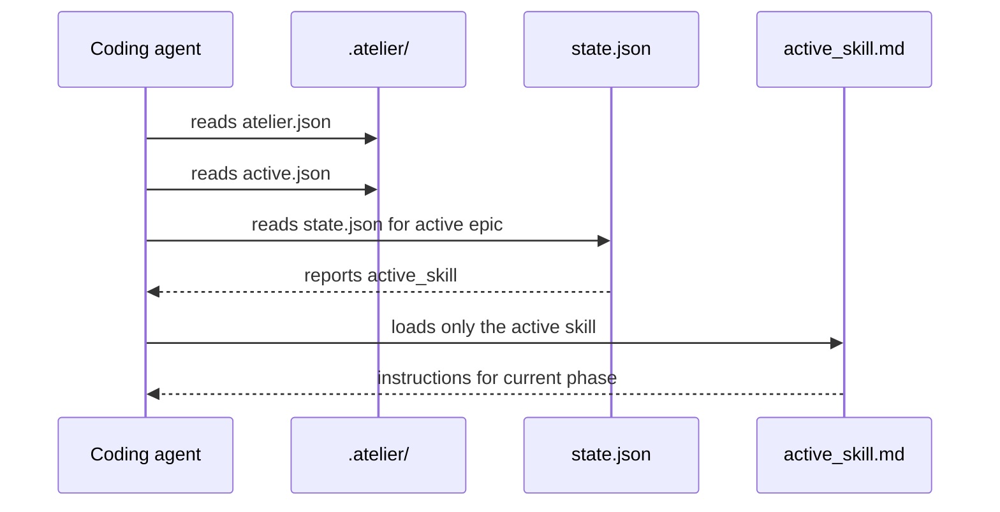

This reduces noise, improves focus, and keeps the instruction budget under control.

---

## 7. Questions come before research

Every epic starts with the questioner.

Before reading the repository, before proposing architecture, before writing a plan, the agent must ask questions that are specific to the project.

These questions cannot be generic. They need to reflect the epic's goal, the system's domain, and the points that must be investigated.

The questioner creates the first quality filter for planning.

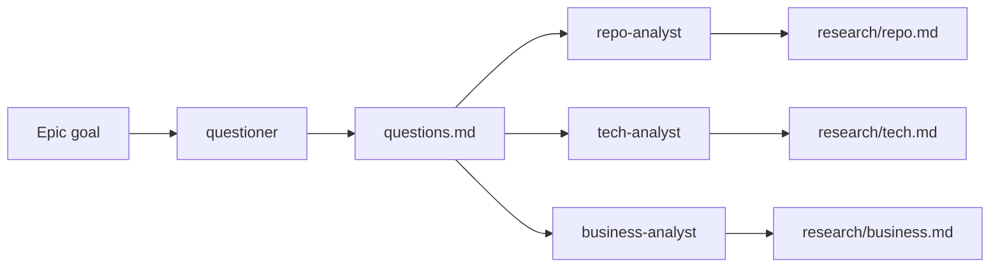

Intent isolation starts here as well. Research tracks receive objective technical questions, which reduces the risk of prematurely confirming an imagined solution.

---

## 8. Research is not the solution

The research phase maps the current state of the system.

It identifies modules, dependencies, existing patterns, versions, technical constraints, business rules, stakeholders, and operational impact.

Research should not jump straight to the answer. It should produce evidence.

After research, synthesis consolidates findings, identifies conflicts, and organizes the team's understanding of the system. It is still not time to decide.

Architectural decisions belong in design.

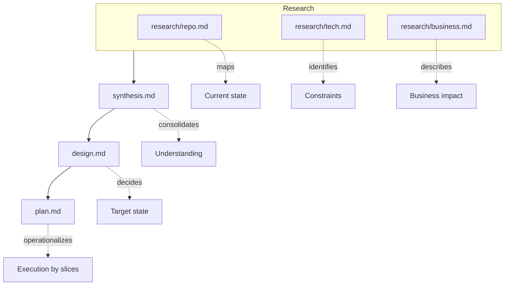

---

## 9. Design is the human review point

`design.md` is where decisions become explicit.

It answers:

- what will change;
- why it will change;
- which patterns should be followed;
- which patterns should be avoided;
- which decisions still carry risk;
- what the desired state of the system is.

Before tactical planning begins, the human should be able to review the design.

atelier-kit assumes agents can help, but important architectural decisions still need human responsibility.

---

## 10. plan.md is the implementation contract

The plan is not a loose task list.

`plan.md` is a verifiable contract between intent, design, and implementation.

It must include the goal, assumptions, risks, and slices. Each slice is a vertical implementation unit with defined scope, allowed files, acceptance criteria, and validation instructions.

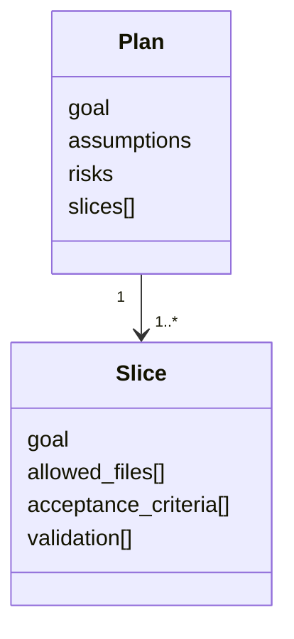

A good slice does not just describe a technical task. It defines something that can be implemented, tested, and reviewed.

---

## 11. Slices limit scope without limiting reasoning

A slice declares which files may be changed.

That does not mean the agent cannot read other files to understand the system. It means the implementation must respect a clear modification boundary.

This contract reduces side effects, makes review easier, and exposes drift.

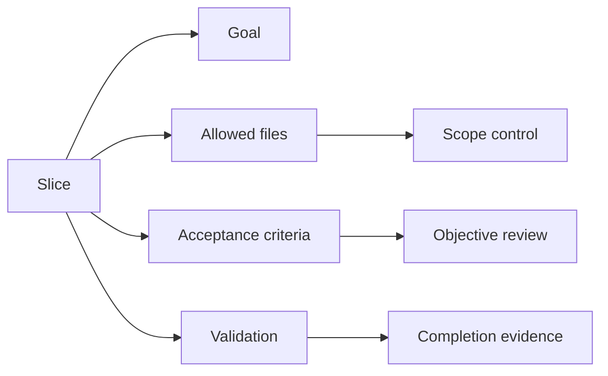

---

## 12. No plan should advance without a gate

The `plan-ready` gate checks whether the plan has enough structure for implementation.

It validates that there is an active epic, that `plan.md` exists, that the plan has a goal, assumptions, risks, and slices, and that every slice includes the required fields.

The gate does not judge whether the idea is brilliant. It checks whether the plan is complete enough to be implemented and reviewed.

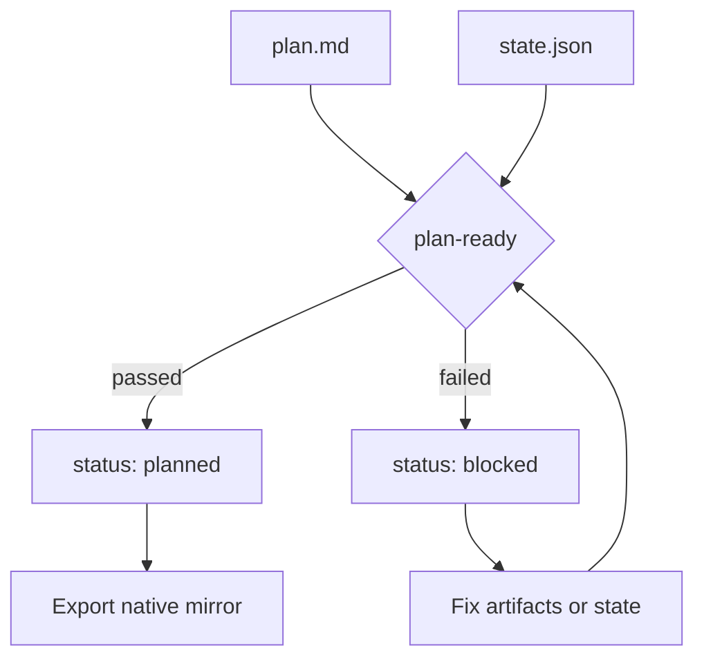

---

## 13. The protocol has modes because not every problem deserves the same weight

atelier-kit recognizes that not every change needs the same amount of ceremony.

There are three modes:

- **quick**: for narrow, low-risk scopes;
- **standard**: for features that touch multiple modules or require meaningful decisions;
- **deep**: for migrations, architectural refactors, legacy systems, and operationally risky changes.

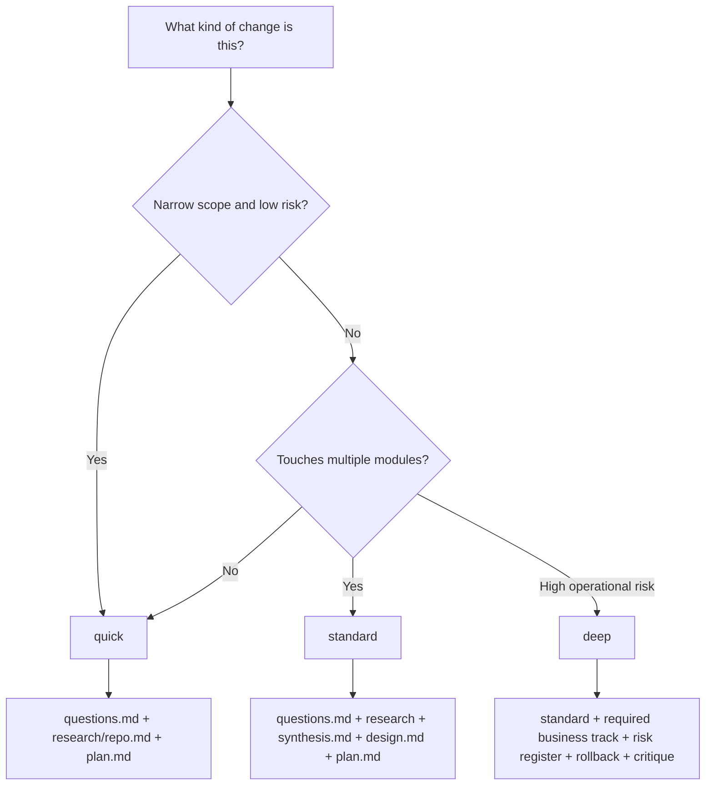

The goal is not bureaucracy. It is to match planning depth to risk and impact.

---

## 14. Native mirrors respect the agent's flow

Each agent has its own preferred way to find and consume plans.

atelier-kit keeps the canonical `plan.md` inside `.atelier/`, but it can export a copy to the agent's native location.

That copy is called a mirror.

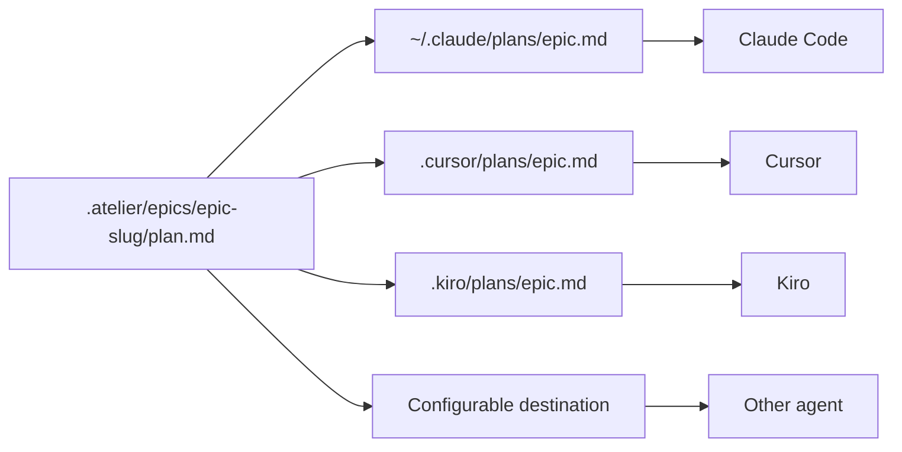

The mirror is derived. The source of truth remains the canonical plan in the epic ledger.

---

## 15. Review must compare promise and delivery

After implementation, atelier-kit becomes useful again.

The `atelier review` command compares the current diff with the planned slices.

The review should answer:

- are the changed files inside `allowed_files`?
- were the acceptance criteria met?
- were the validations executed?
- did the implementation drift from the plan?
- is that drift justified, or does it need correction?

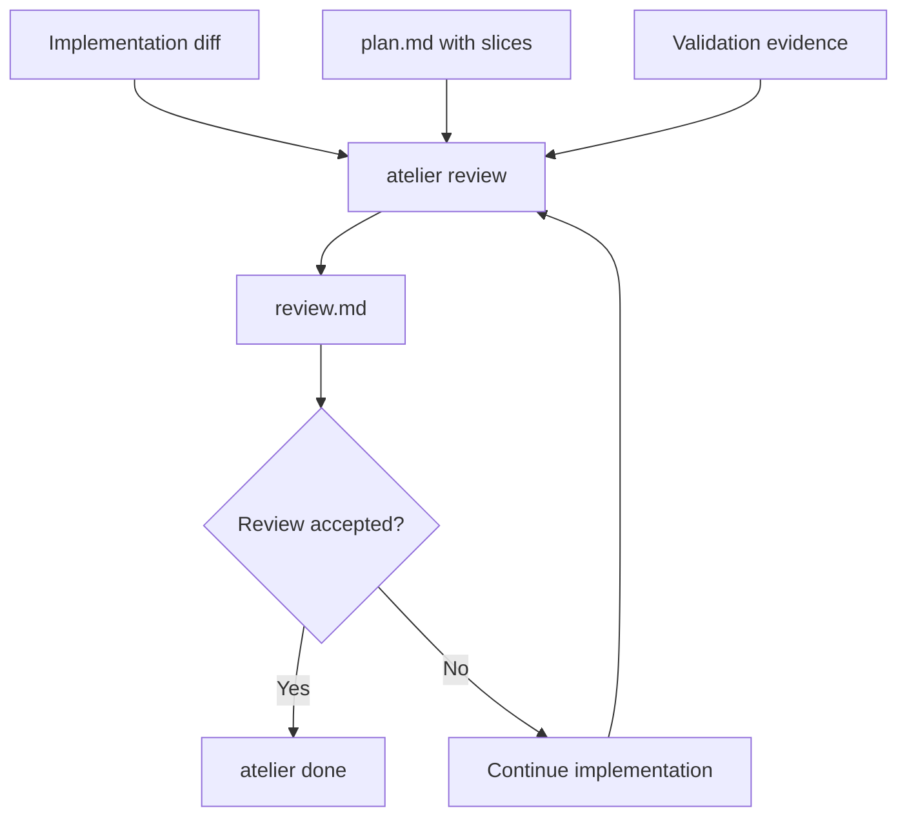

Without review, the plan becomes forgotten intent. With review, the plan becomes the evaluation criteria.

---

## 16. Adapters make the protocol portable

atelier-kit does not belong to one agent.

It can render rules for different tools while preserving the same base protocol.

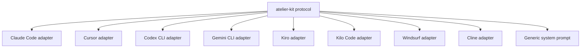

Portability is strategic: teams can change tools without abandoning their planning process.

---

## 17. The operational manifesto

atelier-kit stands on these principles:

### 1. Planning should be explicit

What will be done should be written down before implementation starts.

### 2. Context should be persisted

Important decisions should not live only in chat.

### 3. The agent should work by phase

Each phase needs a clear role and focused instruction.

### 4. Research should come before the solution

The agent should understand the system before proposing changes.

### 5. Design should be reviewable

Architectural decisions need a clear point for human review.

### 6. Plans should be implementable

A good plan describes slices, allowed files, acceptance criteria, and validation.

### 7. Gates should block incomplete plans

Missing evidence should prevent progress.

### 8. Implementation should remain native

The protocol does not replace the coding agent or the developer's preferred tool.

### 9. Review should be based on the plan

Delivery should be compared against the agreed contract.

### 10. The protocol should get out of the way

Once the plan is ready, atelier-kit should reduce interference, not add friction.

---

## 18. The full cycle

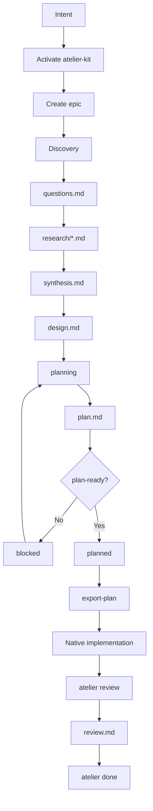

---

## 19. What atelier-kit is not

atelier-kit is not an executor.

It is not an agent orchestrator.

It is not a new IDE.

It is not a replacement for Claude Code, Cursor, Codex, Kiro, Kilo Code, or any other tool.

It is not a layer that decides everything on its own.

It is not a mandatory process for every change.

atelier-kit is an operational convention for verifiable planning.

---

## 20. What atelier-kit is

atelier-kit is a protocol.

A small, installable, versionable protocol.

It creates a shared language between the developer, the agent, and the repository.

It turns intent into questions, questions into research, research into synthesis, synthesis into design, design into a plan, the plan into slices, slices into implementation, and implementation into review.

It makes the agent's work more legible, more verifiable, and safer to trust.

---

## 21. Final statement

We do not need agents that only write more code faster.

We need agents that help us build software with more clarity, more context, and more accountability.

We need to preserve the freedom of native agent workflows, while adding structure when risk calls for it.

We need plans that can be read, reviewed, versioned, and tested.

We need a bridge between human intent and AI-assisted execution.

atelier-kit is that bridge.

Not to control the agent.

But to make collaboration between humans and agents worthy of trust.

---

## Appendix: minimum expected slice structure

```markdown
## Slice 1: Slice name

**Goal**: Describe the implementable goal of this vertical slice.

**Allowed files**:
- path/file-1.ts
- path/file-2.ts
- path/test.spec.ts

**Acceptance criteria**:
- Observable criterion 1
- Observable criterion 2
- Observable criterion 3

**Validation**:
- test or validation command
- check that no file outside allowed_files was changed
```

---

## Appendix: main commands

```bash
atelier init
atelier install-adapter claude-code
atelier new "Add payment system" --mode standard
atelier status
atelier validate --gate plan-ready
atelier export-plan --adapter claude-code
atelier review
atelier done
atelier off
```

---

## Appendix: summary view

```mermaid
flowchart TB
    Root((atelier-kit))

    Root --> OptIn[Opt-in]
    OptIn --> Inactive[Inactive by default]
    OptIn --> Activated[Activated by command]
    OptIn --> Requested[Does not interfere unless requested]

    Root --> Planning[Planning Protocol]
    Planning --> Questions[questions.md]
    Planning --> Research[research]
    Planning --> Synthesis[synthesis.md]
    Planning --> Design[design.md]
    Planning --> Plan[plan.md]

    Root --> State[State]
    State --> Active[active.json]
    State --> StateFile[state.json]
    State --> ActiveSkill[active_skill]
    State --> Violations[violations]

    Root --> Slices[Slices]
    Slices --> Goal[goal]
    Slices --> AllowedFiles[allowed_files]
    Slices --> Acceptance[acceptance criteria]
    Slices --> Validation[validation]

    Root --> Gates[Gates]
    Gates --> Validate[validate]
    Gates --> PlanReady[plan-ready]
    Gates --> Blocked[blocked]

    Root --> NativeAgents[Native Agents]
    NativeAgents --> Claude[Claude Code]
    NativeAgents --> Cursor[Cursor]
    NativeAgents --> Codex[Codex]
    NativeAgents --> Kiro[Kiro]
    NativeAgents --> Kilo[Kilo Code]
    NativeAgents --> Windsurf[Windsurf]

    Root --> Review[Review]
    Review --> Diff[diff]
    Review --> Evidence[evidence]
    Review --> ReviewFile[review.md]
    Review --> Done[done]
```
